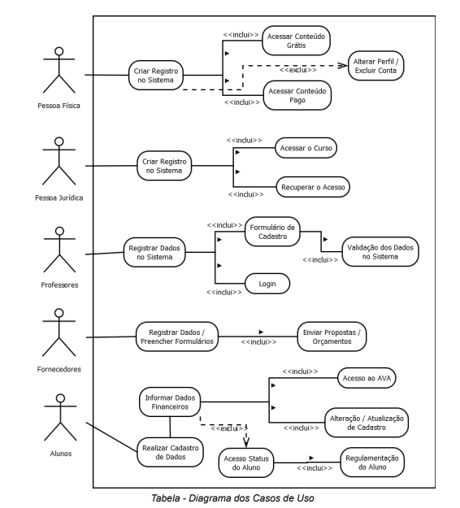

# Projeto PI
### Readme em teste...

PROJETO INTEGRADOR II: DESENVOLVIMENTO DE SISTEMAS
ORIENTADO A OBJETOS

Integrantes do grupo:

Filipe André da Fonseca Simões

Vinícius Guedes de Barros

Pablo Henrique Gomes Barbosa

Vitor Hugo Santana Benevides

Renata Vieira Gonçalves

Marcelo Pazetti

Resumo
O protótipo a seguir, tem como objetivo estruturar o processo da modelagem de um
projeto voltado à gestão de dados de um centro universitário. Tendo o foco no conforto da
rápida manuseabilidade, manutenção e aprendizado tanto do corpo docente, quanto dos
alunos envolvidos neste sistema.
Lista de Ilustrações
4. Modelo de Persistência de Dados Orientada a Objetos:................................................4
4.1. Diagrama de Classes UML......................................................................................... 4
Tabela - Diagrama de Classes UML.......................................................................5
4.2. Descrição textual das classes, atributos, método, relacionamentos e outros.............6
Tabela - Diagrama dos Casos de Uso....................................................................6
Sumário
1. Visão Geral da Proposta....................................................................................................3
1.1. Contextualização e motivação.................................................................................... 3
1.2. Objetivos..................................................................................................................... 3
2. Planejamento para o desenvolvimento da solução proposta:...................................... 3
2.1. Ciclo de vida de desenvolvimento...............................................................................3
2.2. Premissas....................................................................................................................3
2.3. Requisitos / Histórias do usuário.................................................................................3
2.4. Planejamento.............................................................................................................. 3
3. Protótipo funcional e experimentos de usabilidade.......................................................3
3.1. Protótipo funcional com interface humano-computador..............................................4
3.2. Experimento de usabilidade........................................................................................4
4. Modelo de Persistência de Dados Orientada a Objetos:................................................4
4.1. Diagrama de Classes UML......................................................................................... 4
4.2. Descrição textual das classes, atributos, método, relacionamentos e outros.............4
Pessoa Física...............................................................................................................5
Pessoa Jurídica............................................................................................................6
Professores.................................................................................................................. 6
Fornecedores............................................................................................................... 7
4.3. Proposta de implementação........................................................................................8