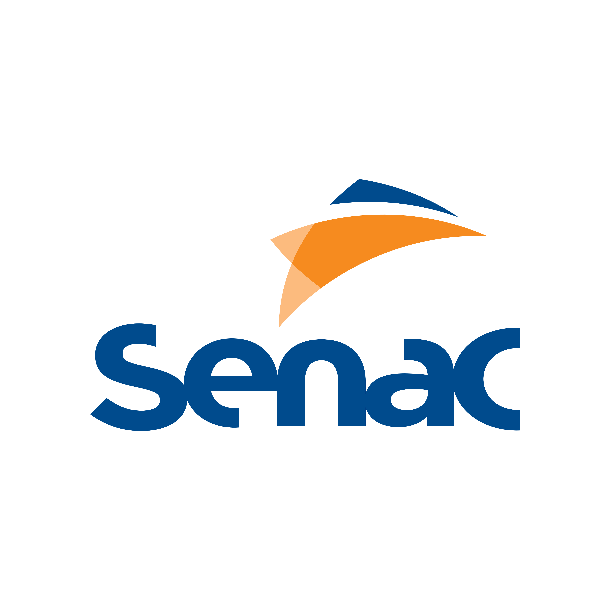
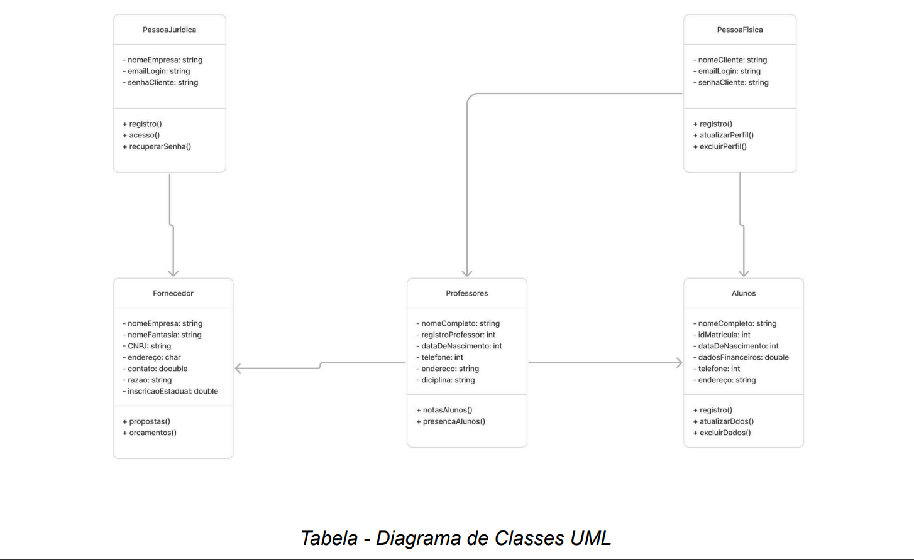
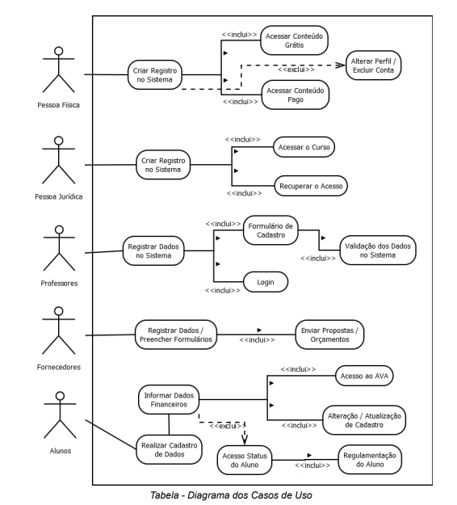
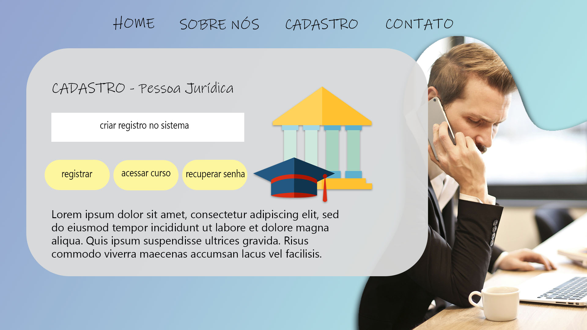
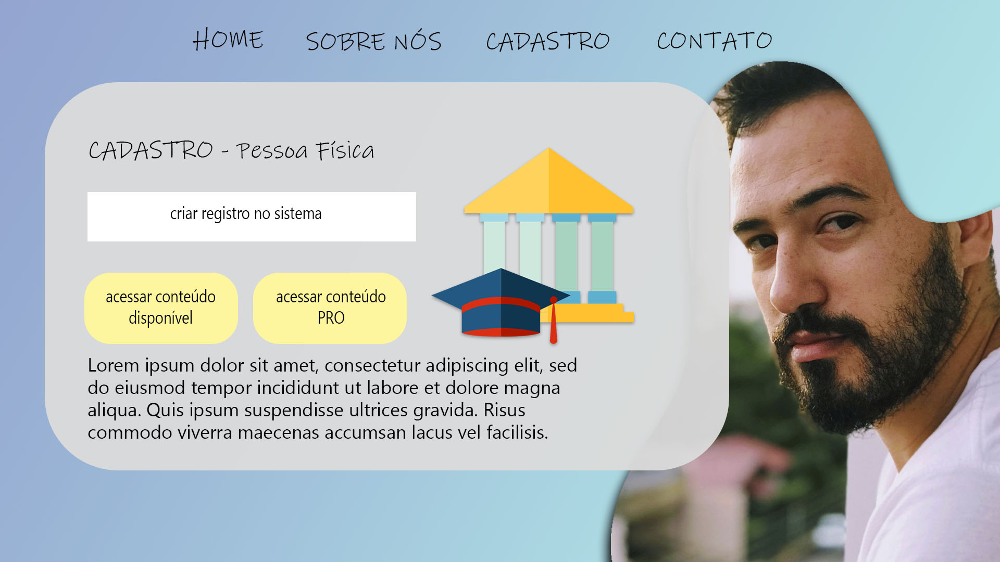
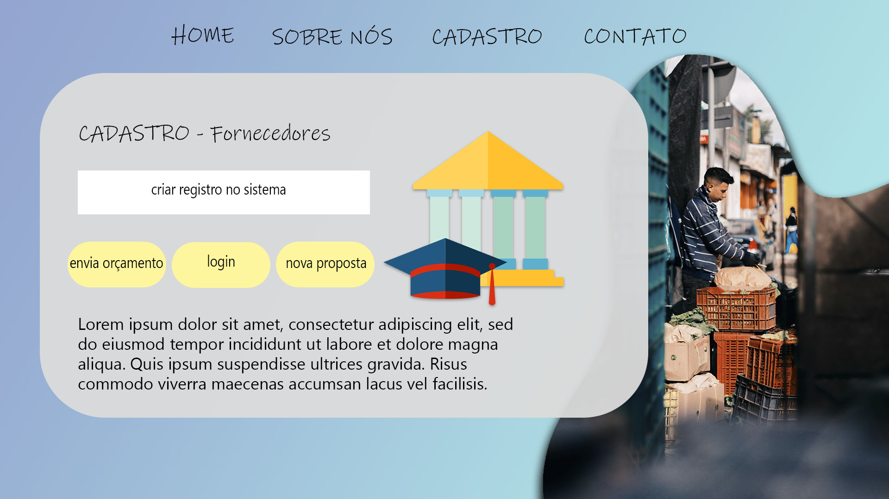
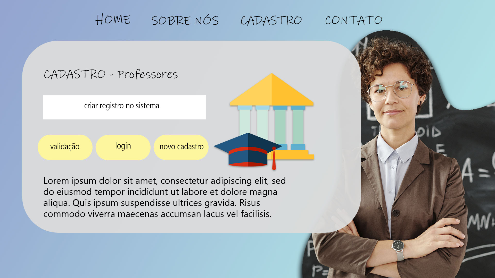
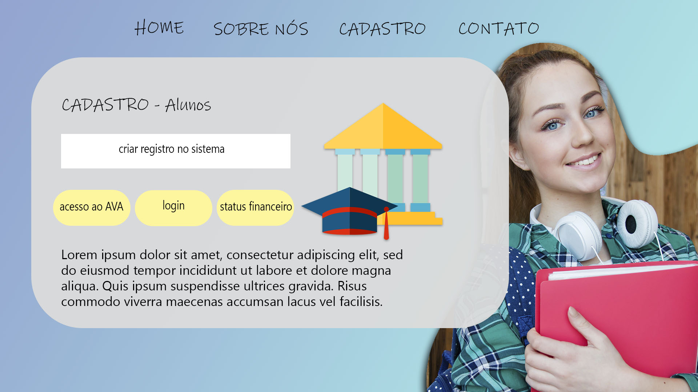

# Projeto PI
## **Readme em teste...**

# SERVIÇO NACIONAL DE APRENDIZAGEM COMERCIAL (SENAC)
## CURSO DE TECNOLOGIA EM ANÁLISE E DESENVOLVIMENTO DE SISTEMAS
### PROJETO INTEGRADOR II: DESENVOLVIMENTO DE SISTEMAS ORIENTADO A OBJETOS

**Integrantes do grupo:**
- Filipe André da Fonseca Simões
- Vinícius Guedes de Barros
- Pablo Henrique Gomes Barbosa
- Vitor Hugo Santana Benevides
- Renata Vieira Gonçalves
- Marcelo Pazetti

**TRABALHO PARA APROVAÇÃO EM DISCIPLINA** EAD - ENSINO À DISTÂNCIA - 2024

**Resumo**

> O protótipo a seguir, tem como objetivo estruturar o processo da modelagem de um projeto voltado à gestão de dados de um centro universitário. Tendo o foco no conforto da rápida manuseabilidade, manutenção e aprendizado tanto do corpo docente, quanto dos alunos envolvidos neste sistema.

**Lista de Ilustrações**
1. Modelo de Persistência de Dados Orientada a Objetos
    1. Diagrama de Classes UML
    2. Descrição textual das classes, atributos, método, relacionamentos e outros

**Sumário**
1. Visão Geral da Proposta
    1. Contextualização e motivação
    2. Objetivos
2. Planejamento para o desenvolvimento da solução proposta
    1. Ciclo de vida de desenvolvimento
    2. Premissas
    3. Requisitos / Histórias do usuário
    4. Planejamento
3. Protótipo funcional e experimentos de usabilidade
    1. Protótipo funcional com interface humano-computador
    2. Experimento de usabilidade
4. Modelo de Persistência de Dados Orientada a Objetos
    1. Diagrama de Classes UML
    2. Descrição textual das classes, atributos, método, relacionamentos e outros
        - Pessoa Física
        - Pessoa Jurídica
        - Professores
        - Fornecedores
    3. Proposta de implementação
   
 ## 4. Modelo de Persistência de Dados Orientada a Objetos:
#### 1. Diagrama de Classes UML
   
   

#### 2. Descrição textual das classes, atributos, método, relacionamento e outros.

 ## 5. Telas do Protótipo do Sistema:
#### 5.1. Tela Pessoa Jurídica
Essa tela permite o **registro/criação** de um novo usuário no sistema, **acesso** ao curso e **recuperação de senha**.
        
#### 5.2. Tela Pessoa Física
Essa tela permite o **registro/criação** de um novo usuário no sistema, **acesso ao conteúdo disponível** e **acesso ao conteúdo PRO**.
 
#### 5.3. Tela Fornecedores
Essa tela permite o **registro/criação** de um novo usuário no sistema, **envio de orçamento**, **login** e **nova proposta**.
 
#### 5.4. Tela Professores
Essa tela permite o **registro/criação** de um novo usuário no sistema, **validação**, **login** e **novo cadastro**.
 
#### 5.4. Tela Alunos
Essa tela permite o **registro/criação** de um novo usuário no sistema, **acesso ao AVA**, **login** e **status financeiro**.
 
